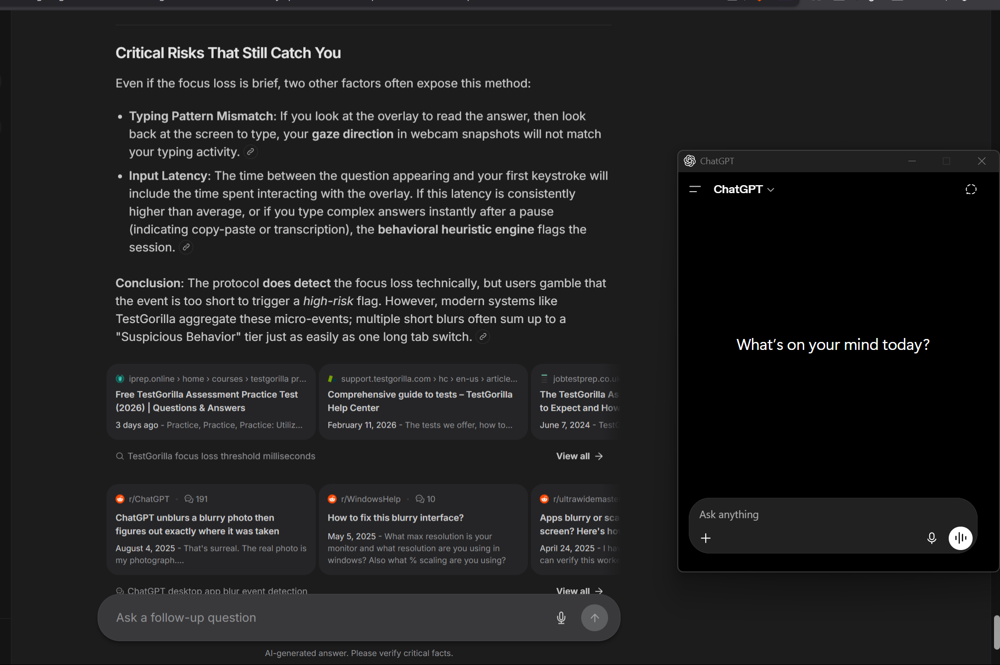

# DocIntel LayoutLMv3

An end-to-end document intelligence system that classifies document images using **Microsoft LayoutLMv3**, **Tesseract OCR**, visual information, and document layout.

DocIntel combines textual, visual, and spatial information to classify documents into five categories through a production-style **FastAPI + Next.js** application.

<p align="center">
  
</p>

---

## Overview

Traditional image classification models mainly rely on visual appearance.

Documents are different.

The meaning of a document often depends on:

- Text content
- Word positions
- Document structure
- Visual appearance
- Spatial relationships between elements

DocIntel addresses this by using **LayoutLMv3**, a multimodal document understanding model that combines text, image, and layout information.

The system accepts a document image, performs OCR using Tesseract, extracts word-level bounding boxes, processes the document using LayoutLMv3, and predicts its document category.

---

## Supported Document Types

DocIntel currently classifies documents into five categories:

| Category | Description |
|---|---|
| Invoice | Bills, invoices, and payment documents |
| Resume | CVs and professional resumes |
| Form | Applications and structured forms |
| Budget | Budgets and financial statements |
| Advertisement | Promotional and advertising documents |

---

## Results

The trained model achieved **93.42% test accuracy** on a test set containing **365 documents**.

| Metric | Result |
|---|---:|
| Test Accuracy | **93.42%** |
| Test Loss | **0.2150** |
| Test Samples | **365** |
| Correct Predictions | **341 / 365** |
| Misclassified | **24 / 365** |

### Per-Class Performance

| Class | Precision | Recall | F1 Score |
|---|---:|---:|---:|
| Invoice | 89.33% | 91.78% | 90.54% |
| Resume | 97.22% | 95.89% | 96.55% |
| Form | 90.28% | 89.04% | 89.66% |
| Budget | 92.11% | 95.89% | 93.96% |
| Advertisement | 98.57% | 94.52% | 96.50% |

---

## Architecture

```text
                         Document Image
                               |
                               v
                    Image Preprocessing
                         (Grayscale)
                               |
                               v
                         Tesseract OCR
                               |
                    +----------+----------+
                    |                     |
                    v                     v
                OCR Words          Bounding Boxes
                    |                     |
                    +----------+----------+
                               |
                               v
                    LayoutLMv3 Processor
                               |
                 +-------------+-------------+
                 |                           |
                 v                           v
           Text + Layout              Image Features
                 |                           |
                 +-------------+-------------+
                               |
                               v
                         LayoutLMv3
                               |
                               v
                    Document Classification
                               |
                +------+------+------+------+------+
                |      |      |      |             |
                v      v      v      v             v
             Invoice Resume  Form  Budget   Advertisement
How It Works
1. Document Upload

The user uploads a PNG or JPEG document through the Next.js frontend.

2. Input Validation

The FastAPI backend validates:

File type
File extension
File size
Empty files
Corrupted images

Maximum supported upload size:

10 MB
3. OCR

Tesseract OCR extracts:

Words
Word-level positions
OCR information
4. Layout Processing

The OCR output is combined with document layout information.

LayoutLMv3 receives:

Text tokens
Bounding boxes
Visual document information
5. Classification

The trained LayoutLMv3 model predicts one of the five document categories.

6. API Response

The backend returns:

Predicted document type
Confidence score
OCR word count
Probability distribution across all classes
Tech Stack
Machine Learning
Python
PyTorch
Hugging Face Transformers
LayoutLMv3
Computer Vision
OCR
OCR & Image Processing
Tesseract OCR
OpenCV
Backend
FastAPI
Uvicorn
Pydantic
Frontend
Next.js
React
TypeScript
Tailwind CSS
Deployment
Docker
Docker Compose
CPU-only PyTorch
Testing
Pytest
FastAPI TestClient
HTTPX
Project Structure
docintel-layoutlmv3/
│
├── app/
│   ├── api/
│   │   ├── ocr.py
│   │   └── prediction.py
│   │
│   ├── core/
│   │   └── config.py
│   │
│   ├── inference/
│   │   └── predictor.py
│   │
│   ├── layoutlm/
│   │   └── processor.py
│   │
│   ├── ocr/
│   │   └── preprocessing.py
│   │
│   ├── schemas/
│   │   └── prediction.py
│   │
│   └── main.py
│
├── checkpoints/
│   └── grayscale/
│       └── best_model/
│
├── data/
│   ├── clean/
│   └── uploads/
│
├── docs/
│   └── demo.png
│
├── frontend/
│   ├── src/
│   │   └── app/
│   │       ├── page.tsx
│   │       ├── layout.tsx
│   │       └── globals.css
│   │
│   ├── Dockerfile
│   ├── package.json
│   └── next.config.ts
│
├── scripts/
│
├── tests/
│   └── test_prediction_api.py
│
├── Dockerfile
├── docker-compose.yml
├── requirements.txt
├── requirements-docker.txt
└── README.md
Running Locally
Prerequisites
Python 3.12+
Node.js 22+
Tesseract OCR
Git
Backend

Create and activate the virtual environment:

python -m venv .venv
.venv\Scripts\Activate.ps1

Install dependencies:

pip install -r requirements.txt

Start FastAPI:

uvicorn app.main:app --reload

Backend:

http://127.0.0.1:8000

Swagger documentation:

http://127.0.0.1:8000/docs

Health check:

http://127.0.0.1:8000/health
Frontend

Open another terminal:

cd frontend

Install dependencies:

npm install

Start Next.js:

npm run dev

Frontend:

http://localhost:3000

The frontend communicates with the FastAPI backend through:

http://127.0.0.1:8000
Running with Docker Compose

DocIntel can run as a complete multi-container application.

                 Docker Compose
                       |
              +--------+--------+
              |                 |
              v                 v
        Next.js Frontend    FastAPI Backend
             :3000              :8000
                                  |
                                  v
                            LayoutLMv3
                                  |
                                  v
                            Tesseract OCR
Build

From the project root:

docker compose build
Start
docker compose up -d
Check containers
docker compose ps

Expected services:

docintel-frontend
docintel-backend
Access the application

Frontend:

http://localhost:3000

Backend:

http://localhost:8000

Swagger API documentation:

http://localhost:8000/docs

Health endpoint:

http://localhost:8000/health
Stop
docker compose down
Docker Architecture

The backend image contains:

Python 3.12
CPU-only PyTorch
FastAPI
Tesseract OCR
Hugging Face Transformers
Cached LayoutLMv3 processor

The trained classifier checkpoint is mounted at runtime instead of being copied into the Docker image.

This keeps large model artifacts outside the application image.

API
Health Check
GET /health

Example response:

{
  "status": "healthy",
  "service": "DocIntel LayoutLMv3"
}
Document Prediction
POST /predict/

Upload a PNG or JPEG image using the file field.

Example using PowerShell:

curl.exe -X POST "http://127.0.0.1:8000/predict/" `
  -F "file=@C:\path\to\document.png"

Example response:

{
  "filename": "invoice_0040.png",
  "document_type": "invoice",
  "confidence": 0.9877653121948242,
  "ocr_words": 85,
  "probabilities": {
    "invoice": 0.9877653121948242,
    "resume": 0.0011811211006715894,
    "form": 0.0018399398541077971,
    "budget": 0.00786387175321579,
    "advertisement": 0.001349683036096394
  }
}
Input Validation

The prediction API validates uploaded files before inference.

Supported formats:

PNG
JPEG
JPG

Maximum file size:

10 MB

The API rejects:

Unsupported file types
Empty files
Invalid file extensions
Oversized files
Corrupted image files

Temporary prediction uploads are deleted after inference.

OCR Preprocessing Analysis

Different preprocessing strategies were evaluated on misclassified documents:

Adaptive thresholding
Grayscale
Original image

The comparison showed that grayscale preprocessing performed better than the existing adaptive-threshold pipeline on the evaluated error set.

Strategy	Avg Words	Avg OCR Confidence	Zero-word Documents
Adaptive Threshold	86.0	38.5	3
Grayscale	86.6	50.3	0
Original	86.6	50.3	0

This analysis helped inform the production preprocessing pipeline.

Testing

The project includes automated API tests covering:

Health endpoint
Successful document prediction
Invalid file type
Empty file
Corrupted image
Oversized file

Run:

python -m pytest tests -v

Current test result:

6 passed
Error Handling

The API uses structured HTTP responses for common failures.

Examples:

Unsupported file
{
  "detail": "Unsupported file type. Only PNG and JPEG images are allowed."
}
Empty file
{
  "detail": "Uploaded file is empty."
}
Corrupted image
{
  "detail": "Invalid or corrupted image. Please upload a valid PNG or JPEG image."
}
Oversized file
{
  "detail": "File is too large. Maximum allowed size is 10 MB."
}
Key Features
Multimodal Document Understanding

LayoutLMv3 combines textual, visual, and layout information rather than relying only on image appearance.

OCR Integration

Tesseract provides OCR text and word-level document information.

Production API

FastAPI exposes document classification through a REST API.

Modern Web Interface

A Next.js frontend provides document upload, prediction results, confidence scores, and class probabilities.

Input Validation

The backend protects the inference pipeline from invalid, empty, oversized, and corrupted uploads.

Containerized Deployment

Docker Compose runs the complete frontend and backend stack.

Automated Testing

The API includes automated tests covering successful and failure scenarios.

Limitations

Current limitations include:

Five supported document categories
Image-based input only
OCR quality depends on document quality
CPU inference is slower than GPU inference
Model checkpoint is maintained separately from the Docker image
Future Improvements

Potential future improvements include:

PDF document support
Multi-page document processing
More document categories
Key information extraction
Named entity recognition
Table extraction
Confidence-based rejection
GPU inference
Batch document processing
Authentication and rate limiting
Cloud deployment
Version

Current release:

v1.0.0
License

This project is intended for educational, research, and portfolio purposes.


### 3. Save it


```powershell
Ctrl + S